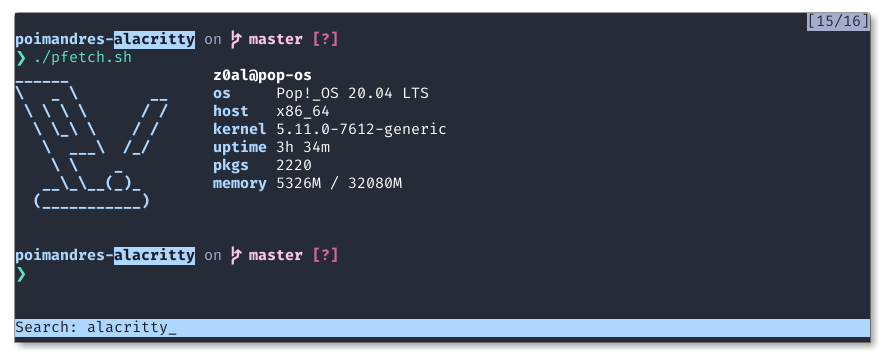

	
	<h1 align="center">poimandres-alacritty 🎨</h1>

An unoffical [Poimandres][poimandres] theme for [Alacritty][alacritty] terminal.

## Screenshots

### Default

	

### Storm

	

**No white variant?** No, sorry! I couldn't stand looking at such bright colors enough to convert it. PRs are welcome though.

## Installation

Simply copy the content of any of the themes at `./theme/` into your `alacritty.yml` configuration file.

That's it!

## Tip

To get the same look as in the screenshots you need the followings:

- Theme: Poimandres
- Font: Fira Code
- Shell: ZSH
- Prompt: [Starship][starship]
- Plugins: [zsh-syntax-highlighting][zsh-syx]

You can also find my complete dotfiles [here][dotfiles]

## Related

- [poimandres-theme][poimandres]: VS Code version
- [poimandres-iterm][poimandres-iterm]: Iterm version

## Credits

Especial thanks to the authors of these projects:

- [Poimandres for VS Code][poimandres]: The original theme.
- [ditto][ditto]: I used it to convert the original VSCode theme to an iTerm2 colors.
- [colortty][colortty]: I used it to convert the output of [ditto][ditto] to Alacritty then modified the output a bit.

[poimandres]: https://github.com/drcmda/poimandres-theme
[alacritty]: https://github.com/alacritty/alacritty
[ditto]: https://github.com/campvanilla/ditto
[colortty]: https://github.com/shuhei/colortty
[starship]: https://starship.rs/
[dotfiles]: https://github.com/z0al/dotfiles
[zsh-syx]: https://github.com/zsh-users/zsh-syntax-highlighting
[poimandres-iterm]: https://github.com/alii/poimandres-iterm/
